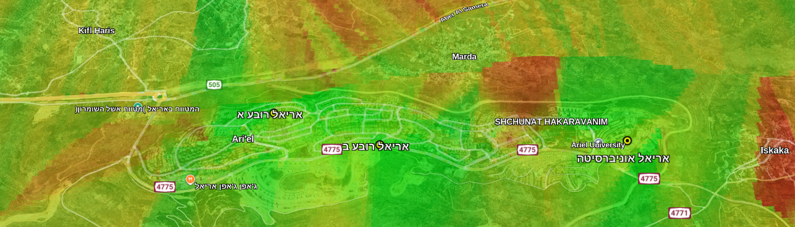

# Cellular Coverage Mapping Project

This project demonstrates a practical workflow for mapping and analyzing cellular network coverage based on real-world signal measurements.
It was developed as part of a research project that combines data collection, processing, and visualization to generate high-resolution coverage maps.

## Overview
The repository contains:

Python scripts for reading CSV files with measurement data and generating KML coverage maps.

A LaTeX article describing the methodology, analysis, and results.

Example images and outputs produced by the project.

## Workflow
Collect signal data using the G-MoN Pro application.

Export measurements to a CSV file.

Run the provided Python script to convert the data into a color-coded KML map.

View the generated coverage maps in Google Earth.

## Features
Convert CSV logs of cellular signal measurements into KML maps.

Support for multiple providers, measurement types (voice/data).

Grid-based interpolation to predict coverage in unmeasured areas.

Color-coded map tiles for quick visual insights.

Configurable thresholds for green/yellow/orange/red zones.

Works seamlessly with Google Earth, Google My Maps, and other KML viewers.

## Installation & Quick Start
### Clone the repository
git clone https://github.com/yourusername/radio-map-generator.git
cd radio-map-generator

### (Optional) create a virtual environment
python3 -m venv venv

source venv/bin/activate   # Linux / macOS

venv\Scripts\activate      # Windows

### Install dependencies
pip install -r requirements.txt

### Command Line Usage
Basic usage:

python cellmap_kml_generator.py \
  --measurements input.csv \
  --antennas antennas.csv \
  --out coverage_map.kml \
  --metric auto \
  --grid_step_deg 0.0005 \
  --tile_alpha 160

#### Main arguments:

--measurements : CSV file with signal measurements

--antennas : CSV with antenna metadata (optional but recommended)

--out : Output KML file

--metric : Signal metric (RSRP, RSRQ, RSSI, or auto)

--grid_step_deg : Grid resolution in degrees (default: 0.0005)

--tile_alpha : Tile transparency (0–255)

## License

This project is for academic and research use.
Please cite the accompanying article if you use or adapt this work.

Pull requests are welcome! For major changes, please open an issue first.
